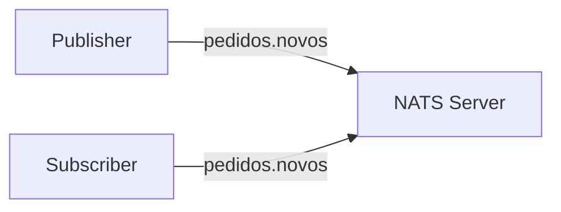
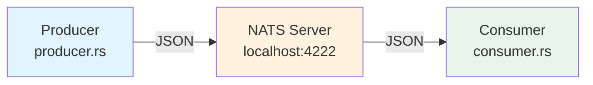
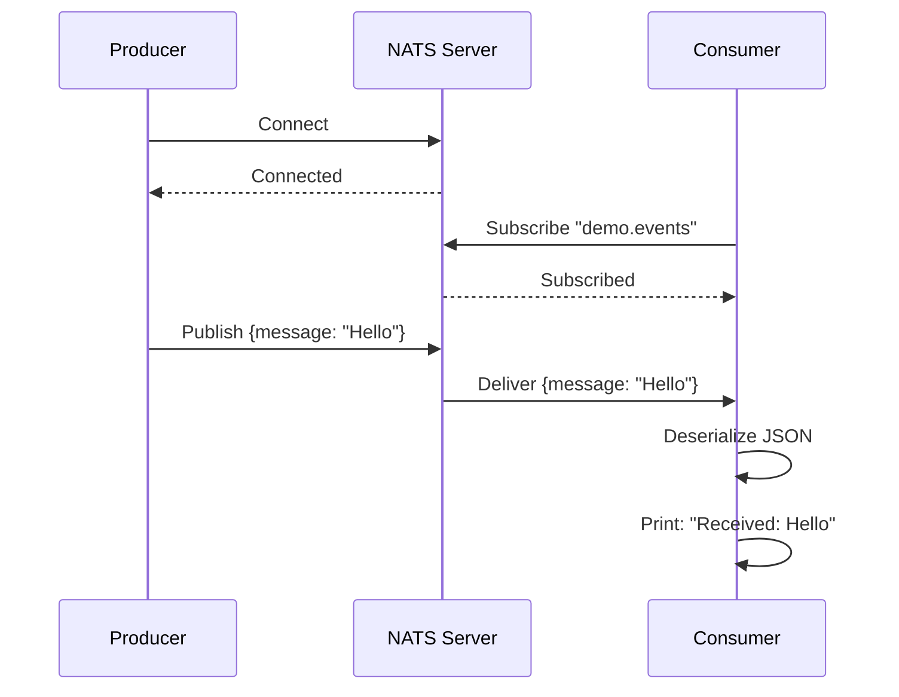

# rust-ai

Exemplo simples de **NATS Pub/Sub** em Rust, demonstrando comunicação assíncrona entre processos.

## O que é NATS?

**NATS** é um message broker leve e de alta performance para comunicação entre serviços.

### Características

- **Pub/Sub**: Publishers enviam mensagens para "subjects", subscribers recebem de subjects
- **Simples**: Protocolo texto simples, fácil de entender
- **Performático**: Milhões de mensagens por segundo
- **Confiável**: Suporta delivery garantido com acknowledgements
- **Escalável**: Native clustering e streaming

### Conceitos principais



| Conceito | Descrição |
|----------|-----------|
| **Subject** | Canal de comunicação (ex: `pedidos.novos`) |
| **Publisher** | Envia mensagens para um subject |
| **Subscriber** | Recebe mensagens de um subject |
| **Message** | Payload serializado (JSON, protobuf, etc) |

## Arquitetura do Projeto



## Fluxo de Dados



## Pré-requisitos

- Rust (rustc, cargo)
- Docker

## Instalação

```bash
git clone https://github.com/Daniel-Dos/rust-ai.git
cd rust-ai
cargo build
```

## Execução

### 1. Subir o NATS Server

```bash
docker run --rm -p 4222:4222 nats
```

O servidor ficará disponível em `nats://localhost:4222`

### 2. Executar o Consumer (assina mensagens)

```bash
cargo run --bin consumer
```

Output esperado:
```
Listening on 'demo.events'...
```

### 3. Executar o Producer (publica mensagens)

Em outro terminal:

```bash
cargo run --bin producer "Hello, World!"
```

Output esperado:
```
Published: Hello, World!
```

O consumer receberá e exibirá:
```
Received: Hello, World!
```

## Testes

```bash
cargo test
```

## Usando com opencode

Este projeto inclui arquivos de configuração para assistentes de IA:

```bash
# Iniciar sessão
opencode

# Comandos disponíveis:
/review           # Revisar código
/test            # Executar testes
```

### Arquivos de configuração

- `AGENTS.md` - Instruções para IA
- `ai-context.md` - Contexto e arquitetura
- `.opencode/skills/` - Skills especializadas

## Estrutura do Projeto

```
src/
├── producer.rs    # Publica mensagens no NATS
├── consumer.rs    # Assina mensagens do NATS
└── main.rs        # Placeholder
```

## Tecnologias

- **async-nats**: Cliente NATS assíncrono
- **serde**: Serialização JSON
- **tokio**: Runtime assíncrono

## Learn More

- [NATS Documentation](https://docs.nats.io/)
- [async-nats crate](https://crates.io/crates/async-nats)
