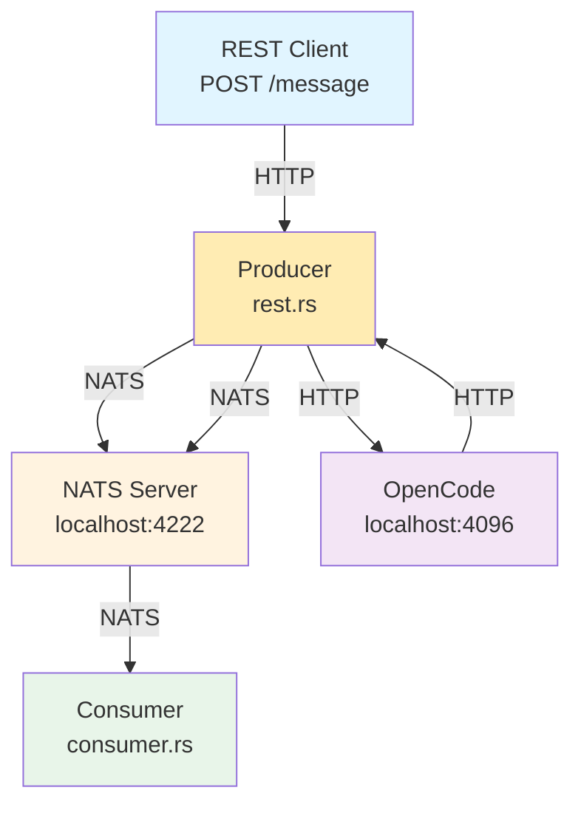
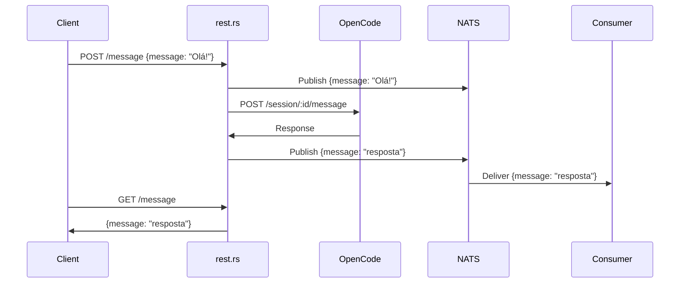

# rust-ai

Exemplo de **NATS Pub/Sub** em Rust com REST API e integração com OpenCode.

## O que é NATS?

**NATS** é um message broker leve e de alta performance para comunicação entre serviços.

### Características

- **Pub/Sub**: Publishers enviam mensagens para "subjects", subscribers recebem de subjects
- **Simples**: Protocolo texto simples, fácil de entender
- **Performático**: Milhões de mensagens por segundo
- **Confiável**: Suporta delivery garantido com acknowledgements
- **Escalável**: Native clustering e streaming

### Conceitos principais

| Conceito | Descrição |
|----------|-----------|
| **Subject** | Canal de comunicação (ex: `demo.events`) |
| **Publisher** | Envia mensagens para um subject |
| **Subscriber** | Recebe mensagens de um subject |
| **Message** | Payload serializado (JSON) |

## Arquitetura do Projeto



## Fluxo de Dados



## Estrutura do Projeto

```
src/
├── main.rs              # Entry point
├── rest.rs             # Módulo REST
├── rest/
│   └── rest_api.rs    # REST API (axum)
├── service.rs         # Módulo Service
├── service/
│   └── opencode_service.rs  # OpenCode service
├── nats.rs            # Módulo NATS
├── nats/
│   ├── producer.rs   # Producer NATS
│   └── consumer.rs  # Consumer NATS
```

### Componentes

| Arquivo | Responsabilidade |
|--------|------------------|
| `main.rs` | Entry point |
| `rest/rest_api.rs` | REST API (axum), publica no NATS |
| `service/opencode_service.rs` | Criar sessão, enviar/receber mensagens do OpenCode |
| `nats/consumer.rs` | Escuta NATS e exibe mensagens |
| `nats/producer.rs` | Publicar no NATS |

## Pré-requisitos

- Rust (rustc, cargo)
- Docker
- OpenCode (opcional)

## Instalação

```bash
git clone https://github.com/Daniel-Dos/rust-ai.git
cd rust-ai
cargo build
```

## Execução

### 1. Subir o NATS Server

```bash
docker run --rm -p 4222:4222 nats
```

O servidor ficará disponível em `nats://localhost:4222`

### 2. (Opcional) Subir o OpenCode Server

```bash
opencode serve --port 4096
```

### 3. Executar o Producer (REST API)

```bash
cargo run --bin producer
```

Output esperado:
```
REST API listening on http://0.0.0.0:8080
```

### 4. Executar o Consumer

Em outro terminal:

```bash
cargo run --bin consumer
```

Output esperado:
```
Listening on 'demo.events'...
```

### 5. Testar via REST API

```bash
curl -X POST http://localhost:8080/message \
  -H "Content-Type: application/json" \
  -d '{"message": "Olá!"}'
```

Resposta:
```json
{"message": "Message received successfully"}
```

O consumer receberá e exibirá:
```
Received: Olá!
```

Recuperar resposta do OpenCode:
```bash
curl http://localhost:8080/message
```

## Testes

```bash
cargo test
```

## API Endpoints

### POST /message
Envia mensagem e publikta no NATS.

```bash
curl -X POST http://localhost:8080/message \
  -H "Content-Type: application/json" \
  -d '{"message": "Olá!"}'
```

### GET /message
Retorna a última resposta do OpenCode.

```bash
curl http://localhost:8080/message
```

## Comandos OpenCode

| Comando | Descrição |
|---------|------------|
| `/test` | Executa `cargo test` |
| `/review` | Executa `cargo clippy` e `cargo fmt --check` |
| `/run` | Verifica NATS e executa o projeto |

## Tecnologias

- **async-nats**: Cliente NATS assíncrono
- **axum**: Framework HTTP
- **serde**: Serialização JSON
- **tokio**: Runtime assíncrono
- **reqwest**: Cliente HTTP

## Learn More

- [NATS Documentation](https://docs.nats.io/)
- [async-nats crate](https://crates.io/crates/async-nats)
- [axum](https://docs.rs/axum)